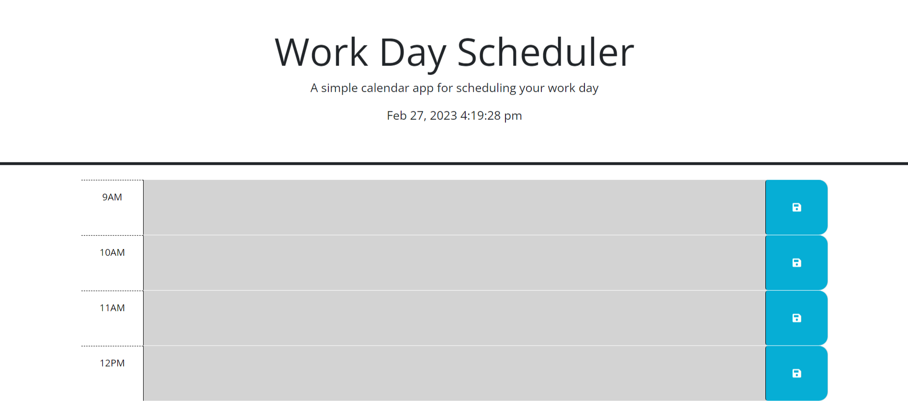

# 05 Third-Party APIs: Work Day Scheduler

## Link to Deployed Application

https://tigergiangnguyen.github.io/work-day-scheduler/

## Short Description

Given a starter code to create a calendar for the user to save inputs that can be checked. Each hour will have a certain color that represents that hour is either past(gray), present(red), and future(green). The user will see when clicked on the link, the gray color is no longer a time that can add will happen unless wait until the next day, or red color means it will happen in a few mins and need to do anything that was assigned as an input, or green color means it will happen later but it did not already past or currently happening. Learning dayjs and jquery helps to messing around with time to apply it into javscript solves you can code less and do more.

## Your Task
The following animation demonstrates the application functionality:


Create a simple calendar application that allows a user to save events for each hour of the day by modifying starter code. This app will run in the browser and feature dynamically updated HTML and CSS powered by jQuery.

You'll need to use the [Day.js](https://day.js.org/en/) library to work with date and time. Be sure to read the documentation carefully and concentrate on using Day.js in the browser.

## User Story

```md
AS AN employee with a busy schedule
I WANT to add important events to a daily planner
SO THAT I can manage my time effectively
```

## Acceptance Criteria

```md
GIVEN I am using a daily planner to create a schedule
WHEN I open the planner
THEN the current day is displayed at the top of the calendar
WHEN I scroll down
THEN I am presented with timeblocks for standard business hours
WHEN I view the timeblocks for that day
THEN each timeblock is color coded to indicate whether it is in the past, present, or future
WHEN I click into a timeblock
THEN I can enter an event
WHEN I click the save button for that timeblock
THEN the text for that event is saved in local storage
WHEN I refresh the page
THEN the saved events persist
```

## Screenshot of Deployed Application



## Credit

 - Bootstrap
 - Google Fonts
 - JQuery
 - Dayjs